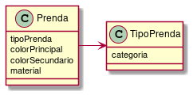

# ¿Qué me pongo? 1ra Iteración

## Diagrama de Clases



## Prenda

Una prenda debe tener obligatoriamente un tipo de prenda, que debe condecirse con su categoría (Zapato -> Calzado, Remera -> ParteSuperior). Para ello puede haber una clase TipoPrenda con un atributo categoria.

```
clase TipoPrenda{
  var categoria
}


// Ejemplo
unaRemera = new TipoPrenda("PARTE_SUPERIOR")

```

Y luego puede hacerse un objeto a partir de Prenda con esa referencia:

```
clase Prenda{
  var tipoPrenda
  var colorPrincipal
  var colorSecundario
  var material

  constructor(tipoPrenda, colorPrincipal, material)

  setColorSecundario(colorSecundario){
    this.colorSecundario = colorSecundario
  }
}


remeraGrisYRoja = new Prenda(unaRemera, "GRIS", "ALGODÓN")

remeraGrisYRoja.setColorSecundario("ROJO")
```

Los strings correspondientes a colorPrimario y colorSecundario así como la categoría pueden ser ENUMS si se definen antes cuales son los posibles valores que puede tomar. Ésto sería ideal para evitar errores de tipeo, por ejemplo:

```

enum Categoria{
  PARTE_SUPERIOR, PARTE_INFERIOR, CALZADO, ACCESORIO;
}

```

El color secundario tiene su setter aparte puesto que es opcional. ¿La variable debería tener un valor por default? (Ej: `colorSecundario = "N/A"`) ¿O debería poder manejar NULL?


